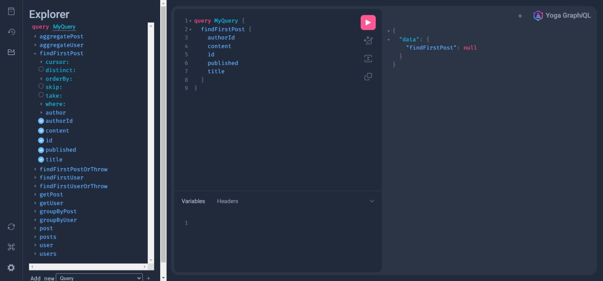

# Graphql-Yoga-Prisma

## What is Graphql-Yoga-Prisma?

### Graphql-Yoga-Prisma is a combination of various modules combined to create an extendible and powerful graphql server that works in any nodejs environment. 

## Features include:

- Integration with Prisma and support for its databases (Sqlite, MySQL, SQL Server, Planetscale, Couchdb, Postgresql, and Mongodb) and also Supabase.
- Integration with Typegraphql for type declaration and to generate CRUD functionality, resolvers, and a schema.
- Includes SOFA Api to automatically generate Rest APIs
- Includes Fastify for extra extendibility and to power the nodejs server.
- Integration with Envelop and its ecosystem of plugins such as Sentry for its error reporting.
- Supports Typescript out of the box
- Integrates with AWS-Lambda to support deploying to a serverless environment
- Supports Cors with the cors module
- Supports logging with Fastify included integration
- Includes File Upload Support

To find out about the different included functionality visit their individual documentations.

Prisma = https://www.prisma.io

Typegraphql = https://www.typegraphql.com

Fastify = https://www.fastify.io

Envelop = https://the-guild.dev/graphql/envelop

Sofa API = https://the-guild.dev/graphql/sofa-api

### To get started with this server

1. git clone https://github.com/bastianhilton/Graphql-Yoga-Prisma
2. cd graphql-yoga-prisma
3. npm install
4. npx prisma db push
5. npx prisma generate
6. ts-node index.ts

### To change your database to another Prisma supported database

1. change the .sample.env file to .env
2. update the DATABASE_URL section with your database url
3. update prisma/schema.prisma file to the database provider
4. update prisma/schema.prisma datasource url to url  = env("DATABASE_URL"). More information about this here: https://www.prisma.io/docs/getting-started/setup-prisma/start-from-scratch/relational-databases/connect-your-database-typescript-postgres

5. npx prisma db push
6. npx prisma generate
7. ts-node index.ts

### How to access your graphql server

http://localhost:4005/graphql

### How to access your swagger Rest API from SOFA

http://localhost:4005/swagger